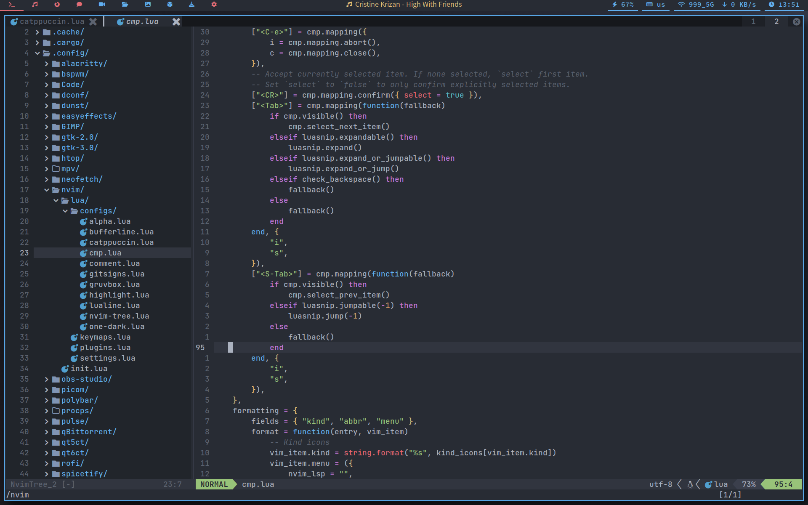
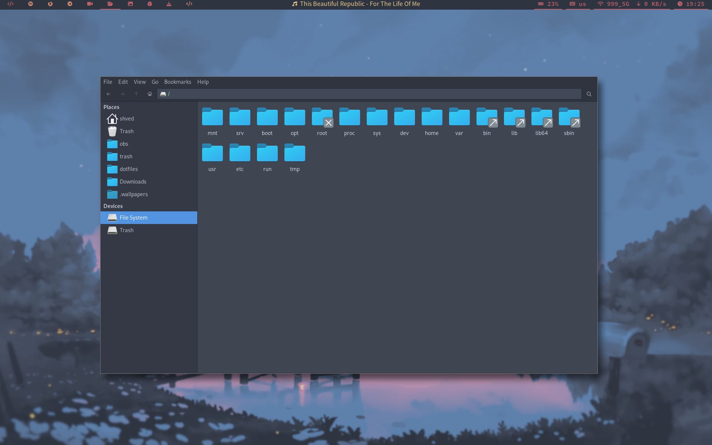

<p align="center">
  
</p>

<p align="center">
  <b> ~ My own dotfiles ~ </b>
</p>

<div align="center">
     
     
     
     
</div>

<div align="center">

# MY BSPWM DOTFILES


## **Overview**


|  |  |
|---|---|
|  |  |
|  |  |


</div>

# **NOTE**

**THIS THREAD IS NO LONGER UPDATED. THE CURRENT REPOSITORY IS IN THE [NEXT](https://github.com/shvedes/dotfiles/tree/next) BRANCH**

# **Table of Contents**

- **[Environment](#Environment)**
  - **[Used neovim plugins](#used-neovim-plugins)**
  - **[Used Thunar plugins](#used-thunar-plugins)**
- **[Features](#features)**
- **[To do list](#to-do-list)**
- **[Aviables themes](#aviable-themes)**
  - **[Color schemes that I plan to add](#color-schemes-that-i-plan-to-add-list-can-grow)**
  - **[Icons](#icons)**
  - **[Cursors](#cursors)**
  - **[LightDM theme](#lightdm-theme)**
  - **[More screenshots](#more-screenshots-list-can-grow)**
- **[Dependencies](#dependencies)**
- **[BSPWM shortcuts](#bspwm-shortcuts)**
- **[Known issues](#known-issues)**
- **[Contributor note](#contributor-note)**


## **Environment**

| Name | Link |
| --- | --- |
| **OS** | **[Arch Linux](https://archlinux.org/)** |
| **Recorder** | **[OBS](https://obsproject.com/download)** | 
| **Editor** | **[Neovim](https://github.com/neovim/neovim)** | 
| **Browser** | **[Firefox](https://www.mozilla.org/en-US/firefox/new/)** |
| **Terminal** | **[Alacritty](https://github.com/alacritty/alacritty)** |
| **Screenshots** | **[Maim](https://github.com/naelstrof/maim)** |
| **Compositor** | **[Picom](https://github.com/dccsillag/picom)** |
| **App launcher** | **[Rofi](https://github.com/davatorium/rofi)** |
| **Clipboard** | **[Greenclip](https://github.com/erebe/greenclip)** |
| **File manager** | **[Thunar](https://github.com/xfce-mirror/thunar)** | 
| **Display manager** | **[LightDM](https://github.com/canonical/lightdm)** |
| **Screen locker** | **[Betterlockscreen](https://github.com/betterlockscreen/betterlockscreen)** |
| **QT theme selector** | **[qt5ct](https://github.com/desktop-app/qt5ct), [qt6ct](https://github.com/trialuser02/qt6ct)** |
| **GTK theme selector** | **[lxappearance](https://github.com/lxde/lxappearance)** |
| **Graphical volume managment** | **[Pavucontrol](https://github.com/pulseaudio/pavucontrol)** |


### **Used neovim plugins**

| Name | Discription | 
| --- | --- |
| **[Alpha](https://github.com/goolord/alpha-nvim)** | **Startup dashboard** |
| **[Cmp](https://github.com/hrsh7th/nvim-cmp)** | **Autocompletion** |
| **[Lualine](https://github.com/nvim-lualine/lualine.nvim)** | **Same as vim airline** |
| **[Packer](https://github.com/wbthomason/packer.nvim)** | **Manage plugins** |
| **[NvimTree](https://github.com/nvim-tree/nvim-tree.lua)** | **File manager** |
| **[Bufferline](https://github.com/akinsho/bufferline.nvim)** | **Buffers** |
| **[Telescope](https://github.com/nvim-telescope/telescope.nvim)** | **Fzf finder** |
| **[Comment](https://github.com/numToStr/Comment.nvim)** | **Usefull shortcuts for comments** |


### **Used Thunar plugins**

- **`thunar-archive-plugin` (the name speaks for itself)**
- **`thunar-media-tags-plugin` (bulk rename and manage media files)**

## **Features**

- **Battery critical level / fully charged alert (udev rule)**
- **USB mouse plug in notification (udev rule)**
- **Battery staus notifications (AC source or battery, udev rule)**
- **USB flash drive plug / unplug notifications (udev rule)**
- **Volume / Brightness / Microphone notifications**
- **Compositor animations**
- **Wifi menu (via rofi)**
- **Current track polybar indicator**
- **Color picker**


## **To do list**

- ~~**Display manager instead of default tty login**~~ 
- **Theme selector script (not sure)**
- **More themes, more cursors, more icons...**
- ~~**Add more comments in configs**~~ 
- **More screenshots with different themes** 


## **Aviable themes**

- **Catppuccin frappe**
- **Catppuccin latte**
- **Catppuccin macchiato**
- **Catppuccin mocha**
- **Gruvbox light**
- **Gruvbox dark**
- **One Dark**
- **Nord**
- **Main** (my own colorscheme based on OneDark)

### **Color schemes that I plan to add (list can grow)**

- ~~**Gruvbox light**~~
- **Dracula**
- ~~**Nord**~~
- ~~**One Dark**~~

**NOTE: you can suggest me the color scheme.**

### **Icons**

- **[Stylish](https://github.com/kuroehanako/Stylish-icon-theme)**
- **[Tela](https://github.com/vinceliuice/Tela-icon-theme)**
- **[Nordzy](https://github.com/alvatip/Nordzy-icon)**

### **Cursors**

- **[Material light](https://github.com/varlesh/material-cursors)**
- **[Bibata](https://github.com/ful1e5/Bibata_Cursor)**
- **[Future](https://github.com/yeyushengfan258/Future-cursors)**

### **LightDM theme**

- **[Aether](https://github.com/NoiSek/Aether)**


### **More screenshots (list can grow)**

<details>
<summary><b>Gruvbox Dark</b></summary>

|  |  |
| --- | --- |
|  |  | 
|  |  |
|  |  |
|  |  |
|  |  |

</details>

<details>
<summary><b>Gruvbox Light</b></summary>

|  |  |
| --- | --- |
|  |  |
|  |  |
|  |  |
|  |  |

</details>

<details>
<summary><b>One Dark</b></summary>

|  |  |
| --- | --- |
|  |  |
|  |  |
|  |  |
|  |  |

</details>

<details>
<summary><b>Catppuccin Latte</b></summary>

|  |  |
| --- | --- |
|  |  |
|  |  |
|  |  |
|  |  |

</details>

<details>
<summary><b>Nord</b></summary>

|  |  |
| --- | --- |
|  |  |
|  | 

</details>

## **Dependencies**

- **`tumbler` (image thumbnails)** 
- **`file-roller` (graphical archive manager)**
- **`xidlehook` (screen saver)**
- **`gvfs-mtp` (file transfer between Android phone and PC)**
- **`maim` (screenshot tool)**
- **`cronie` (for battery status script)**


**All dependencies are aviable in `DEPENDECIES` file. To install them, do the following:**
```
git clone https://github.com/shvedes/dotfiles
cd dotfiles
yay -S $(cat DEPENDENCIES)
```

## **BSPWM shortcuts**


| Parameter                     | Shortcut                      |
|            ---                |           ---                 |   
| **Windows**                   |                               |
| Rotate windows                | Super + R                     |
| Close window                  | Super + Q                     |
| Focus on left                 | Super + J                     | 
| Focus on right                | Super + K                     |
| Focus on bottom               | Super + L                     |
| Focus on top                  | Super + semicolon             |
| Switch to left                | Super + Shift + J             |
| Switch to right               | Super + Shift + K             |
| Switch to bottom              | Super + Shift + L             | 
| Switch to top                 | Super + Shift + semicolon     |
| Resize window                 | Super + Shift + ArrowKeys     |
| **Modes**                     |                               |
| Floating mode                 | Super + Shift + F             | 
| Fullscreen mode               | Super + F                     | 
| Pseudo tiled mode             | Super + T                     | 
| Monocle mode                  | Super + M                     |
| **Workspaces**                |                               |
| Next workspace                | Ctrl + Alt + Right            | 
| Previous workspace            | Ctrl + Alt + Left             |
| Last used workspace           | Super + Tab                   |
| Switch to workspace           | Super + (1-9,0)               |
| Move window to workspace      | Super + Shift + (1-9,0)       |
| **Screenshots**               |                               |
| Fullscreen                    | Super + Shift + Z             |
| Active window                 | Super + Shift + A             |
| Selected area                 | Super + Shift + S             |
| **System**                    |                               |
| Open terminal                 | Super + Return                |
| Open app launcher             | Super + A                     |
| Open clipboard                | Super + V                     |
| Clear clipboard               | Super + Shift + V             |
| Change wallpaper              | Super + Shift + W             |
| Restart BSPWM                 | Super + Shift + R             |
| Quit BSPWM                    | Super + Shift + Q             |
| **Apps**                      |                               |
| Open Firefox                  | Ctrl + Alt + F                |
| Open Spotify                  | Ctrl + Alt + S                |


## **Known issues**

- **Transparent windows flickering (picom fork issue maybe)**

### **QUESTION:** ***Configs don't work on my system!***

  ***Make sure you have all dependencies installed. If the problem persists, then open an issue with a detailed description of the problem***

## **Contributor note**

**Some configs were made with ChatGPT bot :))**

<div align="center"></div>
